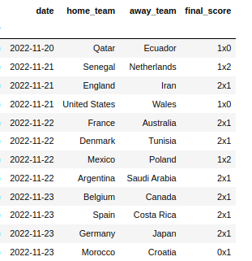

# Forecast da Copa de 2022

## Infos Básicas
- [Regulamento da Copa 2022](https://digitalhub.fifa.com/m/2744a0a5e3ded185/original/FIFA-World-Cup-Qatar-2022Regulations_EN.pdf)
- [Calendário da Copa 2022](https://digitalhub.fifa.com/m/464f16f856f5ed05/original/FIFA-World-Cup-Qatar-2022-Match-Schedule.pdf)

## Datasets

Os datasets deste repositório estão em `/datasets`. Os dados já minimamente pré-processados têm sufixo `preprocessed`, os que não tem são dados originais.

1. `fifa_ranking_before_wc_preprocessed`: Ranking da FIFA antes de cada Copa para cada time. 1575 data points, da Copa de 1994 até a de 2022 (8 copas) e 227 times. [Fonte](https://github.com/mahelvson/WorldCup2022)
2. `elo_rating_preprocessed`: Ranking do Elo Ratings antes de cada Copa. 1848 datapoints, das 8 copas, 249 times. [Fonte](https://github.com/mahelvson/WorldCup2022)
3. `international_football_results` folder: [Dataset do Kaggle](https://www.kaggle.com/datasets/martj42/international-football-results-from-1872-to-2017) com informações sobre partidas de 1872 a 2022. Tem 44.152 resultados. 
4. `fifa_world_cup_2022`: outro dataset do Kaggle, combina o dataset (3) com Ranking da FIFA no momento das partidas e algumas métricas dos times coletadas do jogo FIFA. O ruim é que boa parte dessas métricas estão nulas antes de 2005. [Fonte](https://www.kaggle.com/datasets/brenda89/fifa-world-cup-2022)

## Previsões

Com base nos datasets, principalmente do 3º listado acima, montei um modelo básico para previsão dos jogos da Fase de Grupos, com o objetivo de acertar o resultado (quem ganha ou empate) e o número de gols de cada time. Esse problema é explorado no notebook em `code/model/Model GBDTs.ipynb`. Separando dados de 2018 em diante para validação (que incluem a Copa de 2018), com um modelo sem muito ajuste de parâmetros é possível alcançar 60% de acurácia dos resultados. Já o número de gols é calculado com distribuições de Poisson, típicas para casos como número de gols ([detalhes aqui](https://allendowney.github.io/ThinkBayes2/chap08.html)). O modelo ainda permite muitas melhorias e, aliado a mais dados e melhores estratégias de lidar com a falta deles, é muito provável que haja como ter maior performance. Veja mais detalhes da modelagem no próprio notebook.

As previsões estão em `code/model/predictions/submission.csv`, que contém basicamente essa visão:

Já a estimativa das pontuações finais estão em `code/model/predictions/final_groupmatches_results.csv`.

## Sistema de pontuação da FIFA

> After a long period testing and analysing the best way to calculate the FIFA/Coca-Cola World Ranking, a new model took effect in August 2018 after approval by the FIFA Council.
>
> This new version developed by FIFA was named "SUM" as it relies on adding/subtracting points won or lost for a game to/from the previous point totals rather than averaging game points over a given time period as in the previous version of the World Ranking.
>
>The points which are added or subtracted are partially determined by the relative strength of the two opponents, including the logical expectation that teams higher in the ranking should fare better against teams lower in the ranking.
>
>More details about the formula used in the algorithm, weightings of matches and other characteristics can be found [HERE](https://resources.fifa.com/image/upload/fifa-world-ranking-technical-explanation-revision.pdf?cloudid=edbm045h0udbwkqew35a).

Basicamente, a FIFA adaptou o sistema de Elo Ratings (largamente usado em esportes por décadas), incluindo algumas considerações próprias, como dar mais relevância para partidas de copas do que amistosos. Após uma dada partida de um time A contra um B, a pontuação de A de:
- pontuação prévia
- importância da partida. Amistoso tem menos importância que partidas em Copas ou Qualificações.
- resultado da partida
- resultado esperado da partida. Aqui, calcula-se um resultado esperado usando as pontuações prévias de A e B. Se A era melhor, era esperado que ele tivesse um resultado melhor.
- partidas decididas com pênaltis tem pontuações equilibradas
- perder em um knock-out round não perde pontos para proteger times que chegaram até lá.

Nesse sistema, ainda do "tipo" Elo, é interessante que a cada partida os times trocam pontos iguais (exceto knockout rounds). 

Os dados estão disponíveis em vários momentos ao longo dos anos, o que é um pouco melhor porque nos dá pontos mais atualizados antes de cada copa.

[Referência](https://www.fifa.com/fifa-world-ranking/procedure-men)

## Sistema de pontuação _World Football Elo Ratings_

Esse sistema é o que inspirou a adaptação da FIFA, é bastante similar, levando em conta o resultado do jogo, expectativa prévia e importância das partidas. Porém, me parece que o da FIFA é mais customizado. Além disso, os dados mais compilados do Elo são anuais, portanto para uma dada copa, pegou-se dados do ano anterior. No site dos rankins há informações por partida, mas não compiladas por temporada; estes dados não foram coletados.

[Referência](https://www.eloratings.net/about)

## Links úteis de fontes de dados:
- https://www.eloratings.net/
- https://www.kaggle.com/datasets/brenda89/fifa-world-cup-2022
- https://www.fifa.com/fifa-world-ranking/men?dateId=id13792
- https://github.com/mahelvson/WorldCup2022
- https://mathematicalfootballpredictions.com/
- https://www.jokecamp.com/blog/guide-to-football-and-soccer-data-and-apis/
- https://www.transfermarkt.com.br/statistik/weltrangliste
- https://www.footballcritic.com/fifa-world-cup/season-2022-qatar/18/61217  (pontuações dos jogadores no fim da página)
- https://www.betexplorer.com/links.php
- https://www.kaggle.com/code/amineteffal/who-will-win-world-cup-2022
- https://github.com/davidcamilo0710/QATAR_2022_Prediction/blob/master/Getting_Squads_Stats.ipynb
- https://www.kaggle.com/datasets/martj42/international-football-results-from-1872-to-2017
- https://www.kaggle.com/datasets/brenda89/fifa-world-cup-2022
